detalhes do jogo que podem ajudar a pensarmos num melhor pipeline

primeiro, o que pode mudar todo o projeto e ideias, o jogo tem sistema que aceita controle de videogame,

você pode interagir com o jogo usando isso

as cartas vão ser selecionadas por ordem, ao invés de local, ou seja, podemos contar quantas cartas tem, o que fazem, e pra selecionar a carta correta, basta usar o controle como se estivesse passando pro lado, até chegar na carta correta

segunda coisa

todas as cartas tem uma quantia de mana que é gasta para usar ela, o sistema vai precisar ver quanto de mana temos, quanto a carta custa, e se temos mana suficiente para usar ela, caso tenhamos, descontar o custo de mana e executar a ação da carta, mas quero que ele faça um pipeline inteiro de todas as ações de uma só vez, analisando as coisas que temos, com exceção caso ele vá comprar uma carta ou ataque, pois caso ele compre uma carta, a decisão pode mudar, e caso ele ataque, ele pode subir de nível, que quando acontece, aparece uma tela de escolher uma carta para o deck dele, isso inclui tanto cartas normais quanto cartas de bonus, as cartas bonus ele tem que escolher uma carta para receber.

vou documentar as ações que devem ser feitas para cada tipo de ação no jogo, mas pela quantidade excessiva de ações principalmente em questão de pegar todo tipo de escolha.

MAPA:
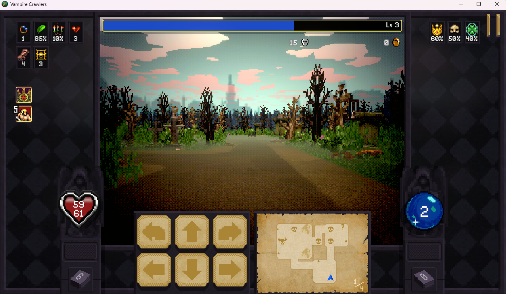

aqui podemos ver o mapa, ele funciona como um tabuleiro, podemos ir pra qualquer lado, no mapa, que fica ao lado dos controles, podemos ver 6 principais elementos:

pontos, caveiras normais, caveiras maiores, ponto de interrogação, uma espécie de pedra (menos visível) e isso tudo com um mapa que forma uma espécie de caminho que podemos seguir.

Pontos: são bonus no mapa, geralmente dão dinheiro ou vida, você deve ficar de frente a ele e andar pra frente, isso dá uma animação e o ponto sai do mapa, então continue para o objetivo (obs, totalmente ignoravel, apenas pegue caso estejam no caminho.

Sempre tente andar pelo mapa de forma reta, por exemplo, caso queira ir para a esquerda, gire seu personagem para a esquerda e depois ande reto

além disso, em questões de pontos, baús, as vezes eles ficam colado a paredes, então não são só blocos, então você deve virar para a parede dele, e assim andar para a frente e entrar no baú/ponto.

Baús: 
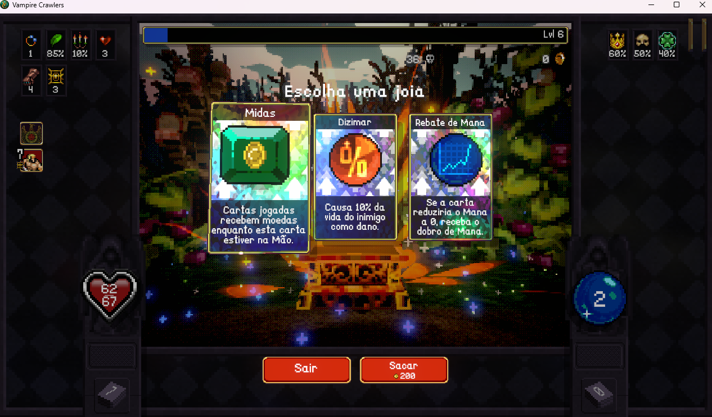 aparece várias opções de bonus que podemos colocar na nossa carta pode escolher ou sacar dinheiro, com quadrado, caso escolha uma carta, vai aparecer outra tela: 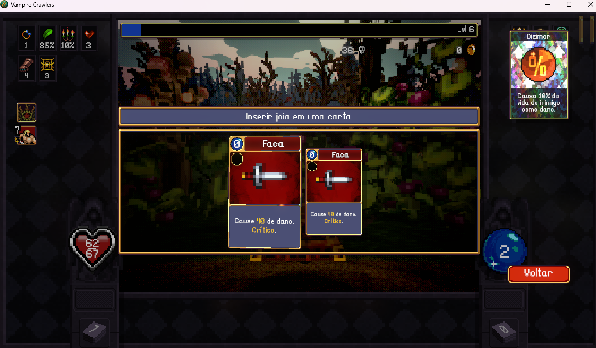, escolha uma carta para colocar a carta e pronto, voltamos para o mapa. As vezes baús vão dar mensagens que não tem cartas, neste caso, basta apertar quadrado para sacar dinheiro e voltar ao mapa. Baús também podem dar opção de Evolução, neste caso, deve-se escolher as duas cartas para evoluir, após escolher evolução, vai aparecer uma tela, aperta X, aparece outra, aperte X novamente. 

Caveiras normais: inimigos, onde caso vc vá para a casa do inimigo, inicia-se o combate.

Caveiras maiores: chefes, onde caso vc vá para a casa do chefe, inicia-se o combate.

Ponto de interrogação: tem alguma coisa, mas acho melhor ignorar por enquanto.

Pedra: não tem nada, é um obstáculo, não pode passar, apenas passar em volta.

a ideia é tentar ficar forte para passarmos de fase, então:

vamos passar por todas as caveiras menores e por fim a caveira maior para passar do chefe.

para andar, os controles são (no controle ps5):

seta cima: pra cima

seta baixo: pra baixo

seta esquerda: pra esquerda

seta direita: pra direita

R2: virar para direita

L2: virar para esquerda

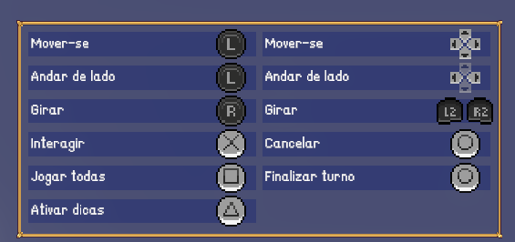

COMBATE:
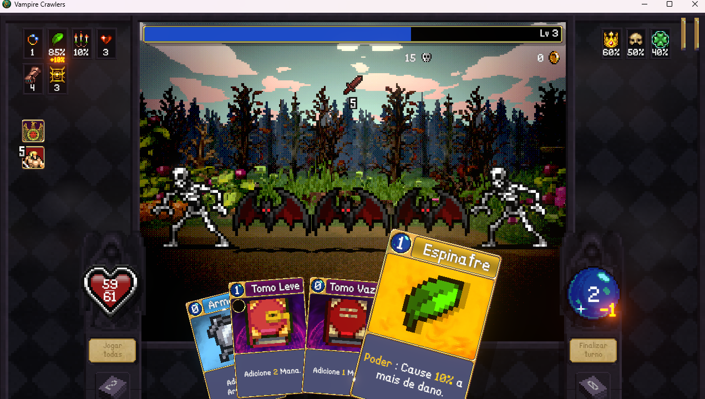
    quando entra em combate, mostra-se uma tela com todas as informações do combate, como:
    - Mana atual
    - cartas na mão
    - Inimigos

percebe-se uma coisa, ao entrar em combate, automaticamente já estamos com a carta mais a direita como selecionada, para selecionar as outras basta ir apertando para a esquerda no controle, e para confirmar a carta basta apertar X

o jogo tem uma estratégia que acredito ser a principal para ganharmos: devemos seguir a ordem de custo das cartas.

todas as cartas na mão tem valores acima, a direita da carta, que é o custo de mana, se eu jogo uma carta de custo 0 e depois uma carta de custo 1, a de custo 1 será buffada, e se eu jogar em seguida uma de custo 2, será ainda mais buffada, e por aí vai. mas pra isso precisamos de mana, então deve se fazer um levantamento de mana necessário, e depois ver as cartas em ordem de custo.

tome a decisão pensando nisso, além disso, certas cartas, escritas como tomo, e com cor vermelha dão mana, use isso a seu favor.

vai ser tomada do agente pensar nisso tudo, mas talvez ele precise saber disso de alguma forma

talvez quando ele entrar em um combate, quando o agente ver que é combate conta quantas cartas tem e executa uma task que tira print de uma carta, passa a esquerda, tira print da outra, e por aí vai, até tirar print de todas as cartas e ele saiba exatamente o que tem na mão para tomar a decisão, por exemplo:

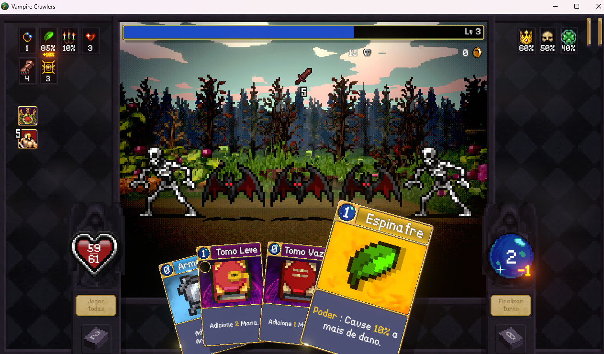 -> assim que começa o combate, ele sabe que tem 4 cartas, e sabe que a mais a direita (espinafre) custa 1 e a descrição logo abaixo é que causa 10% a mais de dano (até o fim do combate).

isso é mandado pro modelo, ele identifica tudo isso, e faz a task, que passa ao lado e tira print das outras cartas, que ele sabe que são mais 3, então ele manda pra pipeline "esquerda, print, esquerda, print, esuquerda, print, e depois recebe tudo isso com contexto para a escolha, as 4 imagens:

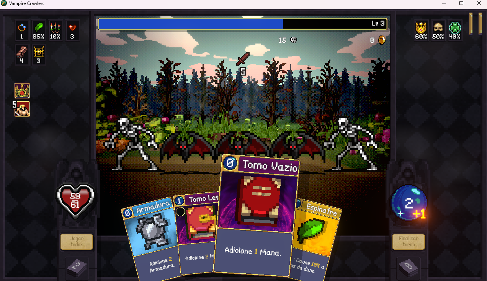

Tomo vazio custo 0 adiciona 1 mana

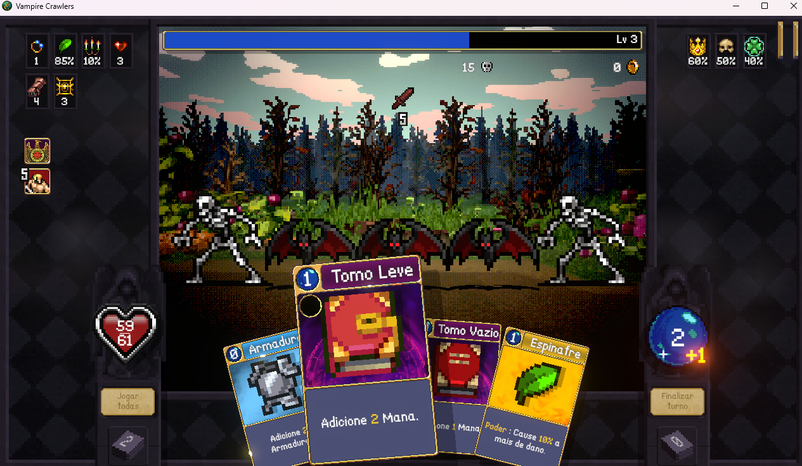

Tomo Leve custo 1 adiciona 2 mana

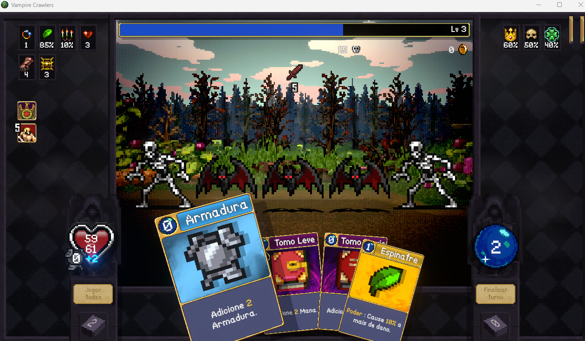

Armadura custo 0 adiciona 2 de armadura (impede 2 de dano na rodada)

o modelo recebe isso e toma decisão.

quero tal carta tal carta tal carta, vai 2 pra direita, usa isso, vai pra esquerda usa isso. lembrando que quando usa a carta ela sai da mão, então tem um movimento a menos, vou simular.

supondo que ele queira usar tomo vazio, espinafre, tomo armadura e tomo leve, nesta ordem, ficaria, em processamento:

(supondo que tiramos print de todas e agora estamos totalmente a esquerda, ou seja, em cima da armadura)

2 direita
X (tomo vazio)
1 direita
X (espinafre)
1 esquerda
X (armadura)
X (tomo leve)

não sei se seria melhor já criar a pipeline direto ou ela analisar a imagem a cada jogada, talvez seja melhor a cada jogada para ter certeza, lembrando, a carta selecionada é a que fica em maior destaque e maior dentre as cartas, isso serve para saber qual está selecionada. podemos também salvar a ordem das cartas, importante.

lembrar de fazer os combos com mana para ter maior chance de ganhar

após ganhar, voltamos para o mapa novamente.

SUBIR DE NIVEL:
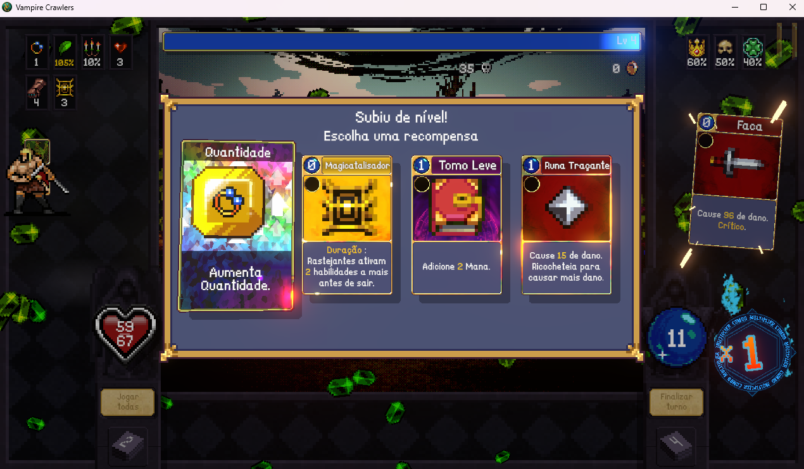

caso suba de nivel, o jogo te da escolhas de cartas, podem ser utilitários, podem ser ataques novos, podem ser bonus de cartas, os bonus de cartas são diferentes, são mais brilhantes e note que no canto superior direito, não tem valor de mana

SE FOR ESCOLHA DE UTILITÁRIO OU ATAQUE:
    basta apertar confirmar na carta e isso volta para o combate

SE FOR ESCOLHA DE BONUS DE CARTAS:

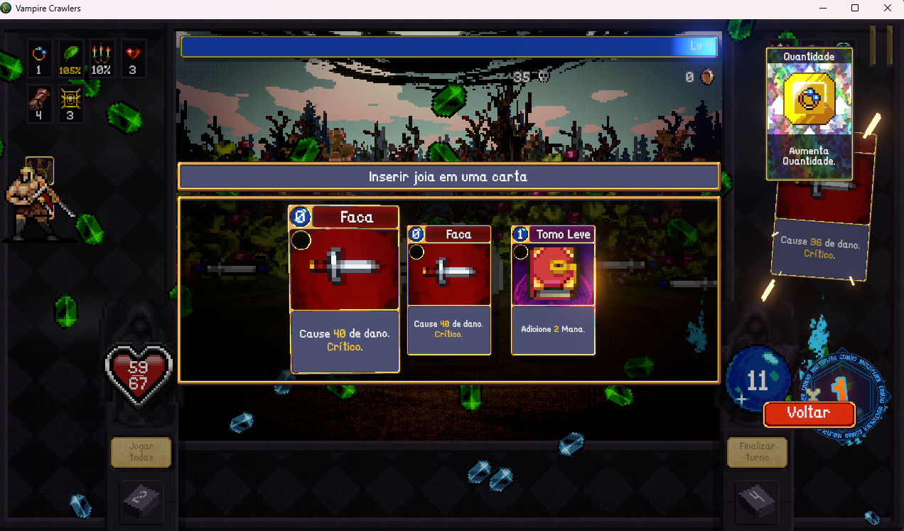
    aparece opções de cartas que podem receber o bonus, basta apertar na carta que quer receber o bonus e confirmar.

percebemos novamente que a carta que está selecionada é aquela que está em destaque e maior dentre as outras, baseado nela, seguir a ordem para escolher a que desejar, basta mover para a carta escolhida e apertar X, confirma.

após confirmar ou você volta para o combate, ou caso tenham sidos os últimos inimigos do combate, volta para o mapa.

Depois de passar por tudo isso, ande para o boss e entre em combate com ele, é igual o combate normal, com excessão que

PÓS BOSS:
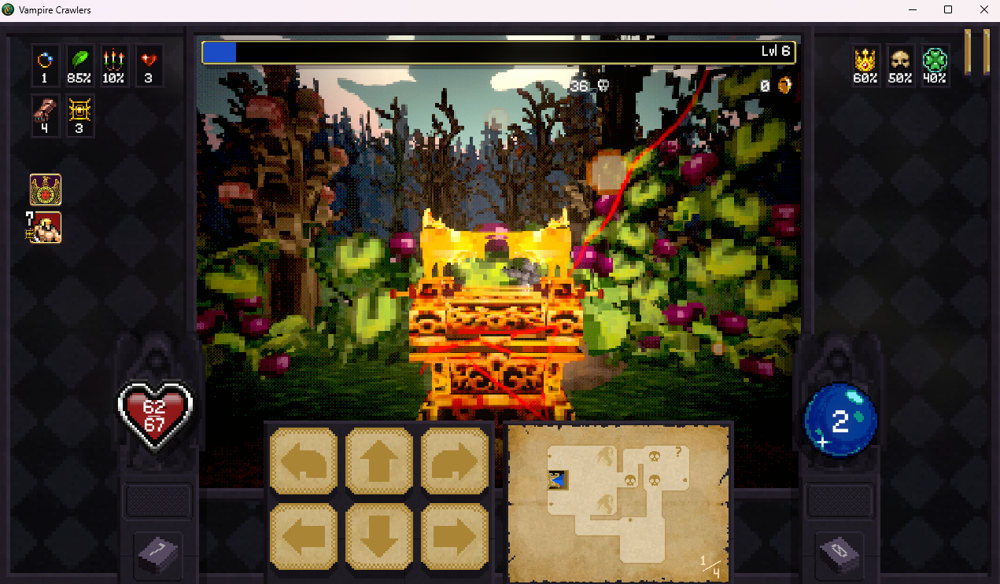
vai aparecer este baú a frente, passe por ele e vai aparecer a opção padrão de baús, que funciona da mesma forma de subir de nível, só que aparecem opções diferentes. como já foi dito anteriormente.

após o baú, voltamos para o mapa e a nossa frente tem uma pá no chão, e também no mapa temos um quadrado preto com nosso ícone de personagem acima, como na imagem: 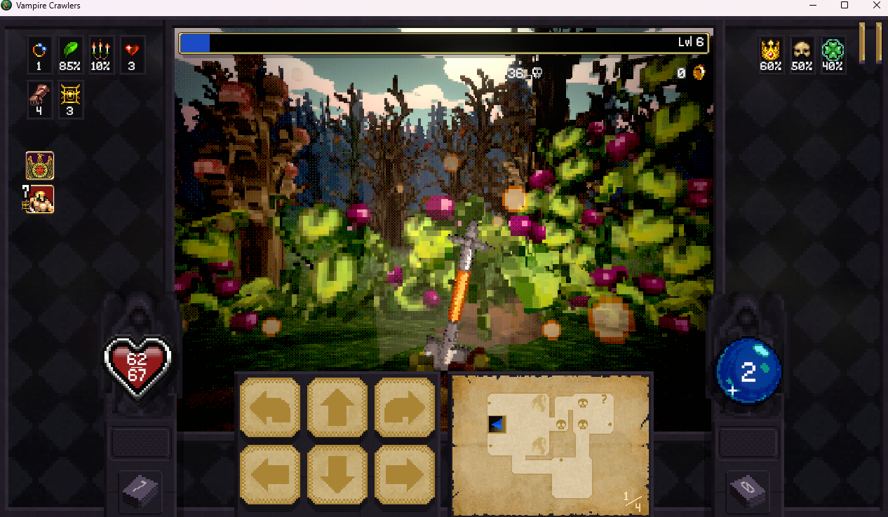

vamos para a próxima fase, basta ir para frente.

na próxima fase, tudo se repete, só que com inimigos e chefes mais difíceis, mas o processo é o mesmo, até chegar no último chefe, que após derrotado, vai aparecer um baú, e após o baú, voltamos para o mapa e partimos para a próxima fase.

após derrotar o último boss, e tentar ir para a próxima fase, vai aparecer esta tela
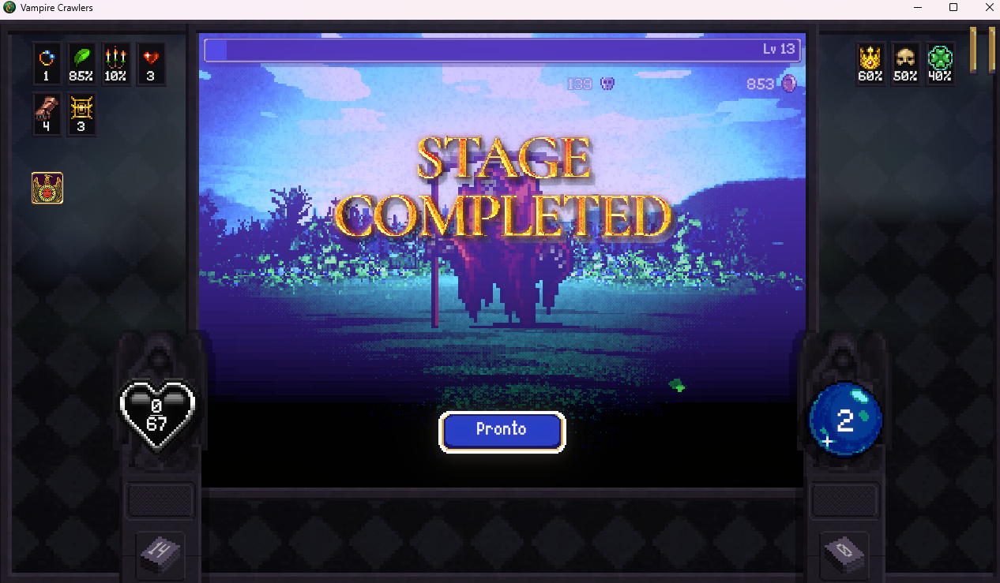

significa que você concluiu o jogo. para ir para o menu principal, aperte X. PARABÉNS!

OBS: acho que seria importante caso seja alguma ação que seja mais de um botão apertado, que tenha um delay entre os botões para não bugar o jogo, caso contrário, pode acabar executando ações erradas ou nem executando corretamente, algo de 1 segundo talvez?

A ideia do projeto é fazer uma IA local llama qwen 2.5 7B pra conseguir jogar Vampire Crawlers, criei vários .md  pra conseguirmos formular o projeto, porém pensei em uma forma  
  que parece ser bem melhor para conseguirmos fazer o projeto, além de documentar basicamente todas as mecânicas que lembrei do jogo  e está tudo escrito no jogo.md escrevi da forma que consegui pensar,   
  mas está mal formatado, afins, faça o que achar melhor e vamos modificar o projeto dessa forma, quero que use seus plugins e raulph loop pra tudo isso.Mudança fundamental input vira   
  gamepad (D-pad + R2/L2 + X/quadrado), não mais clique de mouse em coords. Isso elimina toda a calibração de BUTTONS, HAND_AREA, card_slot_center, etc. Carta selecionada = a maior/em destaque  navegação
  por travessia,não posição.Virtual gamepad via vgamepad (lib Python + ViGEm Bus driver) simula um DualShock/Xbox 360 no nível de driver. O jogo recebe como controle real. Mais fiel ao que o jogo.md       
  descreve, sem ambiguidade.Scan sequencial (como você descreveu): ao entrar em combate, modelo conta cartas no print inicial. Depois pipeline [esquerda  print esquerda print ] até cobrir todas. Cada    
  print é uma carta isolada e grande (a selecionada). Modelo decide ordem com N imagens em contexto.Uma carta por vez: modelo decide só a próxima ação. Executa, tira novo screenshot, modelo decide de    
  novo. Mais robusto a estado inesperado (animação,buff/debuff), mas N chamadas de VLM por turno. (sub-objetivo via VLM, micro-ação via código):                                                
                                                                                                                                                                                                             
                                                                                                                                                                                                
  Custa N chamadas de VLM por rota (4-8 passos por nó × 3-5s/chamada = 15-40s pra chegar num nó). É lento, mas mapa não é caminho crítico de latência (jogo é turn-based; só combate tem alvo   
  de <15s).Pergunta visual é a mais fácil possível pro VLM: o alvo está à minha frente, esquerda, direita ou atrás. Não precisa contar paredes, profundidade, nem ler minimapa pequeno.                    
  Erros não acumulam — cada passo se auto-corrige no próximo screenshot. analise bem o projeto, veja o que foi feito, o que deve mudar , tudo, atualize tudo que foi documentado                             
  com os novos estados, e faca as mudanças features e afins que precisam ser feitas --max-iterations 18 --completion-promise "DONE"             